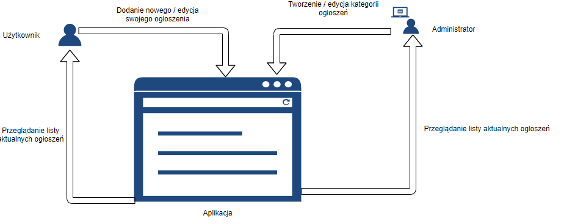

# Serwis ogłoszeniowy
Aplikacja pozwala na zamieszczenie własnego ogłoszenia odnośnie sprzedaży bądź usługi,
ponadto użytkownik może obejrzeć ogłoszenia innych użytkowników.

## Typy użytkowników i ich możliwośći:
- Użytkownik: 
  - Zamieszczenie nowego ogłoszenia
  - Przeglądanie obecnie aktywnych ogłoszeń
  - Edycja swoich ogłoszeń
- Administrator:
  - Zarządzanie kategoriami ogłoszeń
  - Przeglądanie obecnie aktywnych ogłoszeń
 
 

## Wykonali:
- Mateusz Maciąg
- Sławomir Niedbała
- Dariusz Niemczycki

